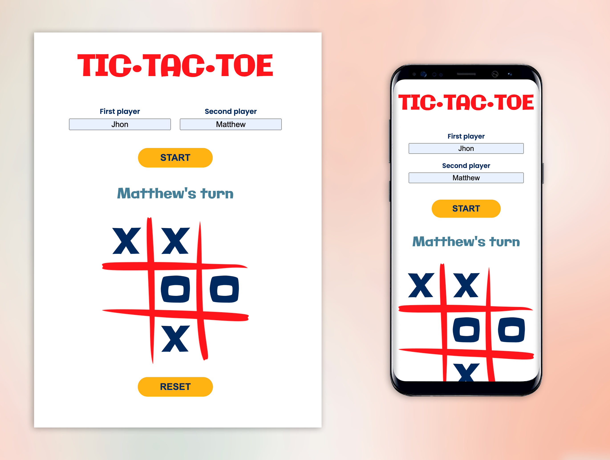

# TIC•TAC•TOE

Welcome to **TIC•TAC•TOE**, a fun and interactive version of the classic Tic-Tac-Toe game, built with HTML, CSS, and JavaScript. This project showcases both graphical and console-based gameplay, offering two ways to enjoy the game: through a visually appealing interface or a text-based version in the console.



## Features

- **Graphical Interface**: A clean, intuitive user interface built with HTML and CSS, allowing players to click on the board to make their moves.
- **Console Mode**: A simple, text-based version of the game, ideal for testing the logic or playing in a retro console environment.
- **Responsive Design**: The game is fully responsive and will adjust seamlessly to different screen sizes and devices.
- **Interactive Gameplay**: Play against a friend.

## Installation

To get started with the project, follow these simple steps:

1. Clone the repository to your local machine:

   ````bash
   git clone git@github.com:seralv/tic-tac-toe.git ```

   ````

2. Clone the repository to your local machine:

   ````bash
   cd tic-tac-toe ```

   ````

3. Launch the index.html file in your browser to play the graphical version, and open the browser console(optional).
